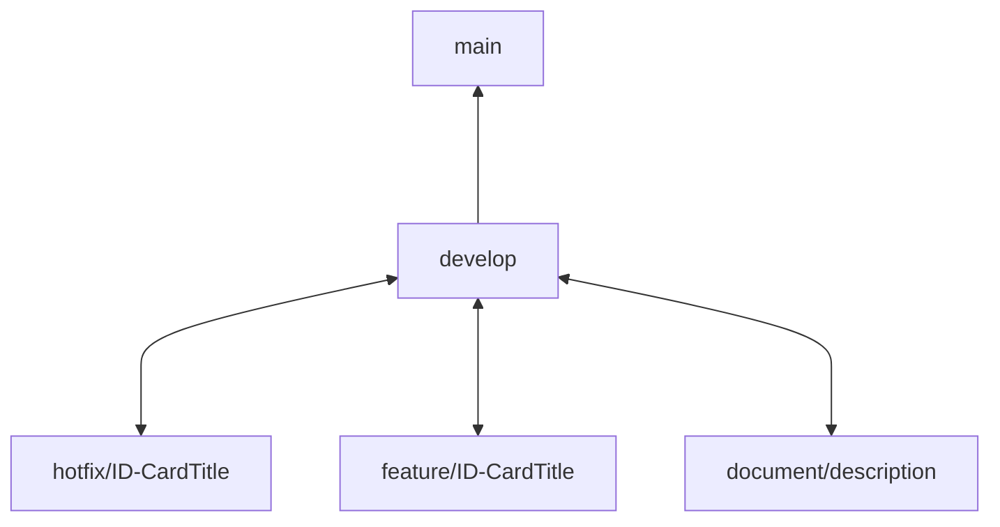

# BackEnd

## 🔀 Estrategia de brancheo y flujo de trabajo

| Branch                    | Branch Origen |  Branch Destino |
|---------------------------|---------------|-----------------|
| main                      |               |                 |
| develop                   | main          | main            |
| feature/[ID]-[CardTitle]  | develop       | develop         |
| hotfix/[ID]-[CardTitle]   | develop       | develop         |
| document/[description]    | develop       | develop         |

### Política de Branching e Integración

- **main** es la rama principal donde se alojan todos los fuentes de "producción". Se llega a la misma mediante una aprobación y por medio de un Pull Request (PR) desde la rama de develop unicamente.
- **develop** contiene la integración de todos los desarrollos que estén realizando. Se llega a estar rama mediante un PR. Cada desarrollador debe salir de esta rama a una propia para realizar modificaciones.
- **feature/...** son los cambios realizados por cada integrante del equipo de desarrollo. Estos cambios en su mayoria representan las tarjetas o tareas descriptas en el backlog del proyecto.
- **hotfix/...** son los cambios que se realizan para corregir errores o bugs detectados en la rama develop. Estos cambios deben ser lo mas acotados posibles y no deben incluir nuevas funcionalidades.
- **document/...** son los cambios que se realizan para actualizar o mejorar la documentación del proyecto. Estos cambios pueden incluir la actualización de archivos README, la adición de diagramas, etc.

### Nomenclatura

**Branches de desarrollo**:

- feature/[ID]-[CardTitle]
- hotfix/[ID]-[CardTitle]

**Donde**:

- **ID**: Identificador único de la tarjeta o tarea (por ejemplo, un número o código).
- **CardTitle**: Una breve descripción de la tarea o funcionalidad (por ejemplo, "CrearMigraciones", "CorregirValidacionEmail").

```
Ejemplos: 
    feature/5-CrearMigraciones
    hotfix/12-CorregirValidacionEmail
```

**Branches de documentación**:

- document/[description]

**Donde**:

- **description**: Una breve descripción del cambio en la documentación (por ejemplo, "EstrategiasDeBrancheo", "DiagramaDeArquitectura").

```
Ejemplos:
    document/EstrategiasDeBrancheo
    document/DiagramaDeArquitectura
```

### Diagrama de flujo de Branches/Pull Requests




**Reglas adicionales:**

1. Los titulos de los PullRequest a develop deben ser el número y nombre de la tarjeta/issue del backlog. Ejemplo:

    ```
    4 - Entidades del MER
    ```
2. Los titulos de los PullRequest a main deben ser el número y nombre del sprint cerrado. Ejemplo:
    ```
    Sprint 1 - Estructura inicial del proyecto
    ```

### Convenciones de Commits

Se utiliza la convención de commits basada en Conventional Commits para mantener un historial claro y estructurado. Los tipos de commits permitidos son:

| Tipo de Commit | Descripción                                          | Ejemplo                                 |
|----------------|------------------------------------------------------|-----------------------------------------|
| feat           | Nueva funcionalidad o característica                 | Agregar entidades de dominio.<br> Implementar endpoint get lista de Especialidades      |
| fix            | Corrección de errores                                | Corregir error en la validación de numero de documento. <br> Deshabilitar validacion de roles medicos. |
| docs           | Cambios en la documentación                          | Actualizar README con instrucciones de despliegue. |
| refactor       | Cambios en el código que no afectan la funcionalidad | Refactorizar DTO de Afiliado.<br> Mejorar estructura de carpetas. |
| perf           | Mejoras de rendimiento                               | Optimizar consulta de agendas de turnos. |
| test           | Añadir o modificar pruebas                           | Agregar pruebas unitarias para el servicio de situaciones terapeuticas. |
| chore          | Cambios en tareas de mantenimiento                   | Actualizar dependencias de NuGet.<br> Agregar migracion de nueva entidad |
| wip            | Trabajo en progreso (cambios incompletos)            | Agregar interfaz de servicio. <br> Agregar metodo auxiliar de validacion. |


**Reglas adicionales:**

1. Los commits al hacer merge desde las ramas feature hacia develop deben ser de tipo feat, de esta forma reflejan el desarrollo de una nueva funcionalidad completa que se agregará a develop.
2. Los commits al hacer merge desde develop a main representan un cambio de versión de la app y el cierre de sprint llevarán un BREAKING CHANGE en la descripción del commit.
3. Los commits de ramas document deben ser de tipo docs para no alterar el historial de desarrollo.

## 🚀 Stack Tecnológico
Este proyecto utiliza el siguiente conjunto de tecnologías:

- .NET 8 (C#) – Plataforma principal para construir la WebAPI y la lógica del negocio.
- Entity Framework Core 8 – ORM utilizado para el acceso y persistencia de datos con MySQL.
- MySQL – Sistema de gestión de base de datos relacional.
- ASP.NET Core Web API – Framework para exponer endpoints HTTP modernos, seguros y escalables.
- Swagger (Swashbuckle) – Herramienta de documentación interactiva para probar los endpoints de la API.

Se eligió este stack dada la familiarizacion de algunos miembros del equipo con dichas tecnologías y el interes de otros por aprenderlas, sumado a la facilidad del lenguaje C# de tipado estático y sintaxis simple.

## 🧱 Arquitectura del Proyecto
Este proyecto implementa una arquitectura basada en capas, inspirada en las arquitecturas Onion, Clean y Hexagonal. La solución está organizada en cuatro proyectos con responsabilidades bien definidas:

- **Dominio:** Contiene las entidades, interfaces. Define el contrato del negocio, sin incluir lógica concreta ni dependencias externas. (Biblioteca de clases C#)

- **Aplicación:** Implementa la lógica de negocio definida en el Dominio, coordinando operaciones y orquestando los procesos entre el sistema y la base de datos. También disponibiliza operacion, valores compartidos y excepciones personalizadas. (Biblioteca de clases C#)

- **Infraestructura:** Implementa los contratos definidos en la capa de Dominio para el acceso a datos, haciendo uso de EntityFrameworkCore. (Biblioteca de clases C#)

- **WebAPI:** Actúa como punto de entrada del sistema, exponiendo los endpoints HTTP y configurando la aplicación (inyección de dependencias, middlewares, etc.).  (ASP.NET Core Web API)

> Las referencias entre proyectos siguen esta cadena: <br> WebAPI → Infraestructura → Aplicación → Dominio

### 🧩 Patrones y prácticas implementadas
- **Repository Pattern:** para abstraer el acceso a datos y mantener la lógica de negocio separada del proveedor de persistencia.
- **Separación de responsabilidades:** cada capa tiene una única responsabilidad bien definida, siguiendo principios de diseño limpio.
- **Inyección de dependencias (IoC):** utilizada para desacoplar la lógica y facilitar pruebas, configurada en `Program.cs`.

## 🛠️ Tecnologías utilizadas 

### 📦 Persistencia de datos
La capa de persistencia está implementada en el proyecto Infraestructura, utilizando Entity Framework Core como ORM para el acceso a datos, junto con MySQL como motor de base de datos.

Para facilitar el trabajo con EF Core, se utilizó el proveedor oficial Pomelo.EntityFrameworkCore.MySql, compatible con MySQL Server y MariaDB.

Se aplicó Code First Migrations, permitiendo generar y actualizar la estructura de la base de datos a partir del modelo de entidades del código. Las migraciones se encuentran organizadas dentro de Infraestructura/Persistencia/Migrations.


> Al iniciar la aplicación, se aplica automáticamente la migración pendiente (si existe), creando o actualizando el esquema de la base de datos sin necesidad de intervención manual.


#### 📋 Guía de Integración de Entity Framework Core
La persistencia en este proyecto se implementa utilizando Entity Framework Core (EF Core) 8.0.13 como ORM con soporte para MySQL, a través del proveedor Pomelo.EntityFrameworkCore.MySql.

##### 📁 Organización
EF Core está integrado en la capa de Infraestructura, bajo la carpeta Persistencia. Allí se define el DbContext principal del proyecto, junto con las configuraciones de entidades y las migraciones.

##### 🔌 Configuración
DbContext se configura e inyecta desde el proyecto WebAPI, donde se define la cadena de conexión en appsettings.json y se realiza la configuración del contexto en Program.cs.

Las migraciones se ubican dentro de Infrastructure/Persistence/Migrations y se generan con el comando:

```
dotnet ef migrations add <Nombre> --project Infrastructure --startup-project WebAPI --output-dir Persistence/Migrations
```

>⚠️ Asegurarse de tener instalado el paquete Microsoft.EntityFrameworkCore.Design en el proyecto WebAPI (startup project). <br>
>⚠️ Es obligatorio asignar un nombre a la migración, ya que EF Core no permite crear migraciones sin nombre. <br>
>⚠️ El directorio donde se ejecuta el comando debe ser el directorio raíz de la solución, no el de un proyecto específico.
##### 📤 Aplicación Automática de Migraciones
Se implementa una estrategia de migración automática en tiempo de ejecución. En Program.cs de WebAPI se invoca:

```
using (var serviceScope = app.Services.CreateScope())
{
    var context = serviceScope.ServiceProvider.GetRequiredService<ProjectContext>();
    context.Database.Migrate();
}
```

>⚠️ Asegurarse de tener instalado el paquete Microsoft.EntityFrameworkCore en el proyecto WebAPI.

Esto permite que la base de datos y su esquema se creen o actualicen automáticamente al iniciar la aplicación, sin necesidad de ejecutar comandos manuales en otros entornos.

##### 📦 Paquetes NuGet Utilizados
>Microsoft.EntityFrameworkCore (8.0.13)<br>
Microsoft.EntityFrameworkCore.Design (8.0.13)<br>
Pomelo.EntityFrameworkCore.MySql (8.0.3)<br>
Oracle.EntityFrameworkCore (8.23.90)<br>
Oracle.ManagedDataAccess.Core (23.9.1)

<br><br><br><br><br>
###### ...
